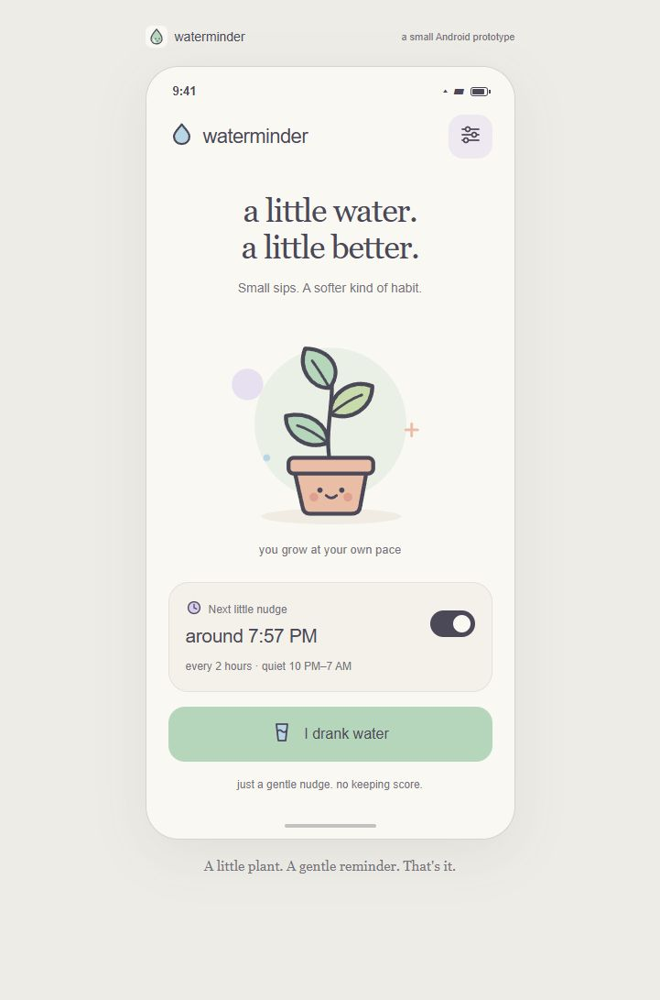

# waterminder

A small, offline Android app for remembering to drink water. Warm cream, sage,
peach, and lavender; original rounded, charcoal-outline artwork inspired by the
Crayon icon aesthetic and shmemplay. A plant, a reminder, and one button.

## Try the prototype

- **Interactive desktop preview:** run `node preview/server.cjs`, then open
  http://127.0.0.1:4173. You can also open `preview/index.html` directly.
- **Installable Android app:** the locally built APK is
  `artifacts/waterminder-0.1.4.apk`. Copy it to your phone and open it to install.
  Android may ask you to allow installation from the app opening the APK.
- Open waterminder, turn on the reminder switch, and allow notifications.
  The Android app starts with reminders off; the desktop preview starts with
  them on to demonstrate the design.

## What it does

- Light and dark appearances follow Android's system theme automatically,
  including the startup background, system bar icons, and time-picker dialogs.
  Dark mode keeps the same pastel plant and accents on a soft charcoal background.
  The browser preview follows the computer's theme; `?theme=dark` or `?theme=light`
  provides a temporary preview-only override for inspecting either appearance.
- A soft blue waterdrop launcher icon with a transparent background.
- Reminders every 1, 2, 3, or 4 hours, or a custom interval from 30 minutes to
  8 hours in 15-minute steps. Default: 2 hours.
- Optional quiet hours, defaulting to 10 PM–7 AM. Overnight and daytime ranges
  work; matching start/end times are rejected.
- A small plant-watering animation and gentle haptic when you tap **I drank
  water**. This dismisses the notification and starts a fresh reminder interval.
- A lock-screen notification with an **I drank water** action that opens the
  app and waters the plant.
- Optional screen wake, default on, and a **Send a test nudge** button. The test
  waits 10 seconds so you can lock your screen first. Tests also respect quiet
  hours. The desktop notification is explicitly a simulation.
- Pause/resume with the home-screen switch. Interval and quiet-hour edits start
  a fresh interval. Changing screen wake preserves the pending reminder time.
- Settings survive app closure and phone restart. Reminders restore after a
  reboot, app update, or clock/timezone change. Missed reminders never accumulate
  into a burst. Quiet hours follow the phone's local time.

No accounts, internet permission, drink quantities, history, streaks, ads, or
analytics. Only reminder preferences and the next scheduled reminder time are
stored locally. The plant is a little moment of encouragement, not a progress
meter.

## Android behavior and prototype limits

Reminders use one-shot `AlarmManager.setAndAllowWhileIdle` alarms. Android may
deliver them late while saving battery; the app checks quiet hours again at
delivery. It does not request exact-alarm access or run a persistent service.
Android cancels alarms when an app is force-stopped; reopen waterminder to resume.
If notification permission is restored after a canceled reminder, reopening the
app restores scheduling.

Screen wake is **best-effort**, not guaranteed to match Snapchat on every phone.
An optional, brief legacy screen wake lock is used when the display is off,
notifications are allowed, and Do Not Disturb is off. It never launches a
full-screen activity or bypasses the lock screen. Some Android versions and
manufacturers restrict this API. Enable lock-screen notifications in the phone's
settings and use the delayed test to check your device. The test briefly keeps
the CPU awake; it can be lost if the app process is killed during those 10 seconds.

The APK has been compiled, linted, and tested with Robolectric, including app
startup and notification-action handling. The interactive preview has been
visually checked at normal and 320-pixel widths. Version 0.1.3 was installed and
launched on a connected Samsung SM-S928U; the dark appearance was visually
checked on the phone. Haptics, real Doze delivery, and screen wake still need a
phone check.

## Build

Requires JDK 17, Android SDK Platform 36 and Build Tools 36.0.0. Android 8.0+
(API 26); targets API 36. Kotlin and Jetpack Compose, using the same toolchain as
shmemplay. Create `local.properties` with your SDK path or set `ANDROID_HOME`.

```powershell
.\gradlew.bat :app:testDebugUnitTest :app:lintDebug :app:assembleDebug
```

The build writes `app/build/outputs/apk/debug/app-debug.apk`. GitHub Actions runs
the same checks and uploads the APK. On Linux/macOS use `./gradlew`.

The 23 tests cover scheduling replacement/cancellation, blocked notifications,
permission denial, reminder delivery, quiet-hour delivery delays, reboot restore,
drink-action resets, a delayed test notification, startup, quiet-hour boundaries,
local timezone behavior, and both daylight-saving transitions.

## Files

- `app/` — the native Android app and reminder tests.
- `preview/` — a dependency-free interactive browser companion; its settings
  are stored separately from the Android app.
- `preview/screenshots/` — screenshots of the verified preview.
- `.github/workflows/android.yml` — tests, lint, and APK build.


